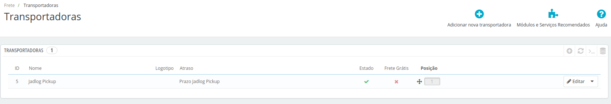

[//]: # (To view this file use: python -m pip install grip; python -m grip -b "Jadlog - Prestashop.md")
[//]: # (https://github.com/settings/tokens)
[//]: # (vim ~/.grip/settings.py)
[//]: # (PASSWORD = 'YOUR-ACCESS-TOKEN')
[//]: # (https://github.com/naokazuterada/MarkdownTOC)
[//]: # (Many thanks to silentcast for animated gif generation: ppa:sethj/silentcast)

# Módulo de Frete Jadlog - Prestashop 1.7

## Conteúdo
<!-- MarkdownTOC -->

- [Introdução](#introdu%C3%A7%C3%A3o)
  - [Compatibilidade](#compatibilidade)
  - [Arquivos e documentos necessários](#arquivos-e-documentos-necess%C3%A1rios)
  - [Avisos importantes](#avisos-importantes)
    - [Nota sobre localização](#nota-sobre-localiza%C3%A7%C3%A3o)
- [Instalação](#instala%C3%A7%C3%A3o)
- [Configuração](#configura%C3%A7%C3%A3o)
  - [Parâmetros iniciais](#par%C3%A2metros-iniciais)
  - [Configurar Transportadora](#configurar-transportadora)
  - [Configurar produtos](#configurar-produtos)
- [Utilização pelos clientes](#utiliza%C3%A7%C3%A3o-pelos-clientes)
  - [Escolha do ponto de retirada](#escolha-do-ponto-de-retirada)
- [Utilização pelo administrador da loja](#utiliza%C3%A7%C3%A3o-pelo-administrador-da-loja)
  - [Enviar solicitação de coleta](#enviar-solicita%C3%A7%C3%A3o-de-coleta)
- [Desenvolvimento](#desenvolvimento)

<!-- /MarkdownTOC -->

## Introdução

Este documento auxilia a instalação, configuração e utilização do módulo Prestashop na integração do serviço de frete Jadlog Pick Up em sua plataforma e-commerce Prestashop.

### Compatibilidade

- Prestashop versão 1.7.
- **PHP 7** com extensão PHP SOAP disponível em seu servidor para integração do módulo ao webservice.

### Arquivos e documentos necessários
Após o aceite da Proposta Comercial, serão fornecidos:
- Contrato Jadlog
- Documento técnico de acessos para configurações
- [Arquivo zip com o módulo Jadlog - Prestashop](../package/jadlog-prestashop.zip)
- Este manual de instalação e utilização

### Avisos importantes
* Deve-se testar o módulo em um ambiente de homologação antes de colocá-lo em produção.
* Faça backup do sistema regularmente - especialmente antes de instalar um novo módulo.

***A Jadlog não se responsabiliza por eventuais perdas de dados.***

#### Nota sobre localização
Recomendamos o uso do software Prestashop adaptado às peculiaridades do Brasil para a utilização correta deste módulo. Essa adaptação envolve certos procedimentos de configuração que não fazem parte do escopo deste documento.  
* *Sobre esse assunto há amplo material disponível para consulta na internet*.

## Instalação
Certifique-se que o software Prestashop está instalado em local seguro em seu computador/servidor. Para instalar o módulo basta enviar o respectivo arquivo *zip* através da página de gerenciamento de módulos. O acesso é feito através do menu *MELHORAR -> Módulos -> Módulos e serviços*. Para enviar o módulo deve-se clicar no botão *Enviar um módulo* que aparece na parte superior direita da tela:

Em seguida deve-se escolher o arquivo *jadlog-prestashop.zip* que corresponde ao módulo Prestashop - Jadlog:

Assim que for enviado, deve aparecer a seguinte mensagem:

A partir dessa tela deve-se clicar em *Configurar* para prosseguir.

## Configuração
Após o envio bem sucedido do módulo pode-se acessar a configuração clicando no botão "Configurar" que aparece na sequência ou então acessando o menu *MELHORAR -> Módulos -> Módulos e serviços* e em seguida clicando-se na aba *Módulos instalados*, botão *Configurar* ao lado do módulo da **Jadlog**:

### Parâmetros iniciais
Após clicar em *Configurar* será exibida a página com os parâmetros iniciais do módulo:

- **Link PUDO**:  
Endereço para consulta dos pontos de retirada (pickup).  
Valor padrão: *http://mypudo.pickup-services.com/mypudo/mypudo.asmx*

- **Chave de acesso PUDO**:  
Chave do serviço de consulta de pontos de coleta fornecida pela Jadlog após a assinatura do contrato.

- **Nome**:  
Nome da loja.

- **Id Jadlog**:  
Identificação de cliente fornecida pela Jadlog após a assinatura do contrato.

- **E-mail Jadlog**:  
Email do contato da loja.

- **Login Jadlog**:  
Usuário para acesso à cotação de frete. Preencher com o CNPJ da sua empresa, com zeros à esquerda e sem pontuação.* Ex: 09998887000135.

- **Senha Jadlog**:  
Senha para acesso à cotação de frete fornecida pela Jadlog após a assinatura do contrato.

- **Token Embarcador Jadlog**:  
Token de autorização fornecido pela Jadlog após a assinatura do contrato  
O token deve ser preenchido no formato *xYz1234.xYz1234.xYz1234*, removendo a palavra *Bearer* caso o token seja fornecido com ela.

- **Conta Corrente**:  
Conta corrente fornecida pela Jadlog após a assinatura do contrato.

- **Código de Contrato Jadlog**:  
Número de contrato fornecido pela Jadlog após a assinatura do contrato.

- **CPF ou CNPJ**:  
Preencher com o CNPJ da loja (somente números sem pontuação).

- **Nome Remetente**:  
Nome do remetente.

- **Endereço**:  
Endereço da loja. Preencher com o tipo e nome do logradouro.

- **Número**:  
Número do endereço da loja.

- **Bairro**:  
Bairro da loja.

- **Cidade**:  
Cidade da loja.

- **UF**:  
Estado da loja (informar a sigla com dois caracteres).

- **CEP**:  
CEP da loja (somente números).

Após preencher corretamente todas as informaçoes deve-se clicar no botão *Salvar* encontrado no canto inferior direito da página:

### Configurar Transportadora
Para habilitar a escolha de frete Jadlog o último passo é ativar a nova forma de envio. Para isso, deve-se acessar a página de *Transportadoras* pelo menu *MELHORAR -> Frete -> Transportadoras*.

Após adicionar o módulo *Jadlog - Prestashop* será adicionada uma nova transportadora *"Jadlog Pickup"* por padrão.

Para adicionar o logotipo referente ao serviço primeiro faça o *download* [deste arquivo](logo-transparente.png) (caso prefira o logotipo em fundo branco, faça o download [deste arquivo](logo.png)) e salve numa pasta local. Em seguida, clique em *Editar* ao lado da transportadora *Jadlog - Pickup* e escolha o arquivo salvo anteriormente clicando no botão *Escolha um arquivo* ao lado do campo *Logotipo*.

A tela deve ficar similar ao exemplo abaixo:

Para gravar o logotipo deve-se clicar no botão *Finalizar* situado no canto inferior direito dessa página.

### Configurar produtos
Todos os produtos devem possuir seus respectivos pesos e dimensões corretamente cadastrados para que o cálculo do frete seja exato.

Esses atributos são informados na aba *Frete* do cadastro de produto:

## Utilização pelos clientes
Após configurado o módulo os clientes poderão escolher a nova forma de frete **Jadlog Pickup**:

### Escolha do ponto de retirada
Caso o cliente escolha como forma de entrega a modalidade "Jadlog Pickup" ele terá a oportunidade de escolher um ponto de retirada próximo ao endereço que ele preencheu no cadastro

O cliente deve escolher o ponto desejado, preencher o CPF e clicar em selecionar. O valor do frete será recalculado de acordo com o ponto escolhido.

Caso o cliente deseje confirmar o horário de atendimento do ponto escolhido basta clicar em *Ver horários*:

## Utilização pelo administrador da loja
Os pedidos feitos pelos compradores que escolheram uma das formas de entrega **Jadlog Pickup** irão aparecer na tela *Gerenciamento de Encomendas - JADLOG* acessível pelo menu *VENDER -> Pedidos -> Jadlog*.

### Enviar solicitação de coleta
Para enviar a solicitação de coleta basta clicar no botão *Enviar* ao lado do respectivo pedido. Após o envio será exibida uma mensagem que informará se o pedido foi inserido com sucesso ou não:

Ao voltar a tela exibirá os dados que o sistema retornou a partir da solicitação de coleta na Jadlog. Deve-se notar que serão preenchidos os campos *ShipmentId* e *Server response*.

O status "Solicitação inserida com sucesso" indica que a Jadlog recebeu corretamente o pedido de coleta e dará prosseguimento ao processo de coleta e posterior entrega do pedido.

Caso ocorra algum erro para algum pedido novo ou outras situações não descritas neste manual entre em contato com a Jadlog.

## Desenvolvimento

* [Jadlog](http://www.jadlog.com.br) - *Uma empresa DPDgroup*

